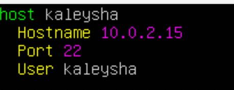
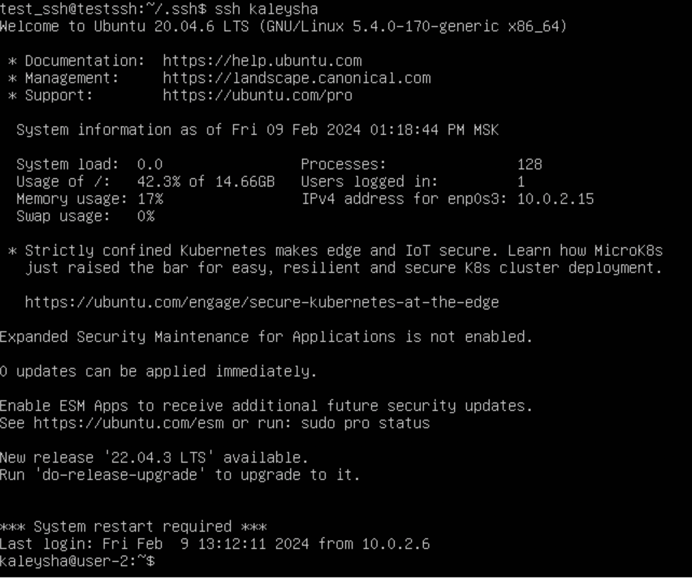
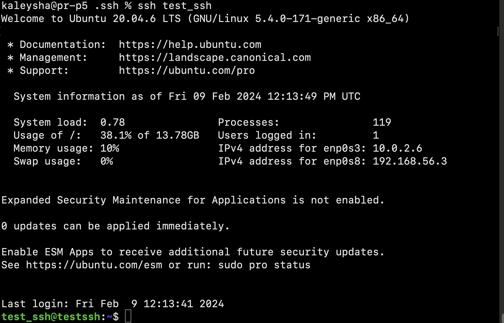
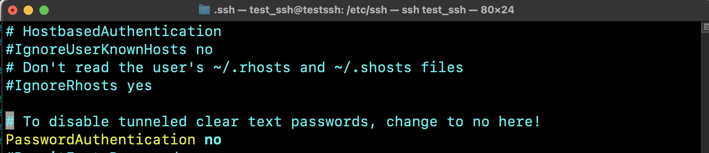
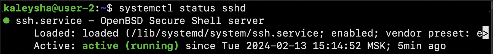
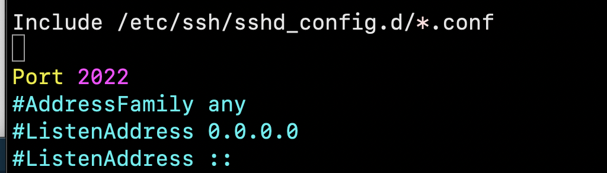
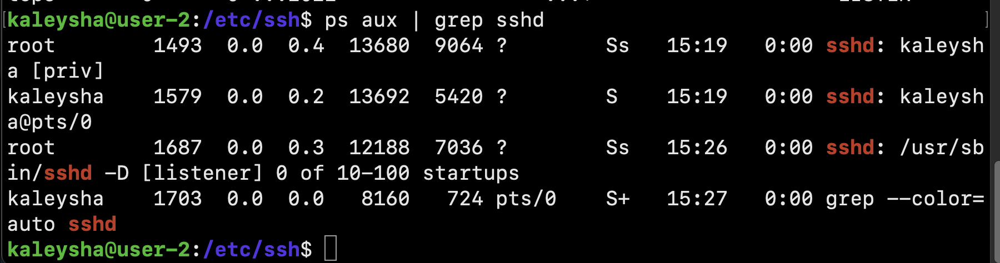
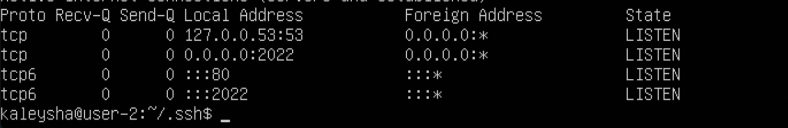

# Linux system installation and updates. Administration basics.

## Part 1. Installation of the OS

1. Install Ubuntu 20.04 Server LTS without GUI.

## Part 2. Creating a user

Create a user other than the one created during installation. 
The user must be added to **adm** group.

1. How many users exist before I add a new one.

2. A new user has been added.

>  **adm**: Group adm is used for system monitoring tasks. Members of
> this group can read many log files in /var/log, and can use xconsole.
> Historically, /var/log was /usr/adm (and later /var/adm), thus the
> name of the group.
> 

3. Group names for the new user (before and after being added to the adm group)

## Part 3. Setting up the OS network

Set the machine name as user-1

1. Hostname before any changes

2. After using the **set-hostname** command

Set the time zone corresponding to your current location.

Output the names of the network interfaces using a console command.

> When a physical network interface is disconnected for any reason, like a hardware 
> failure or being physically detached from the network, the machine can’t use it for any 
> communication, even with itself.
> However, because the loopback interface is only an internal virtual 
> interface with no physical hardware, the machine can use it anytime to communicate with itself.
> This can help in troubleshooting scenarios where we want to isolate and identify if a network 
> issue is caused by an internal problem inside the machine network stack itself.

Use the console command to get the ip address of the device you are working on from the DHCP server.

> A DHCP Server is **a network server that automatically provides and
> assigns IP addresses, default gateways and other network parameters to
> client devices**. It relies on the standard protocol known as Dynamic
> Host Configuration Protocol or DHCP to respond to broadcast queries by
> clients.

Define and display the external ip address of the gateway (ip) and 
the internal IP address of the gateway, aka default ip address (gw).

Set static (manually set, not received from DHCP server) ip, gw, dns settings 
(use public DNS servers, e.g. 1.1.1.1 or 8.8.8.8).

Reboot the virtual machine. Make sure that the static network settings (ip, gw, dns)
correspond to those set in the previous point.

Successfully ping 1.1.1.1 and ya.ru remote hosts and add a screenshot of 
the output command to the report. There should be "0% packet loss" phrase in command output.

## Part 4. OS Update

Update the system packages to the latest version

## Part 5. Using the sudo command

Allow user created in Part 2 to execute sudo command.

In the report explain the true purpose of sudo command (don’t write about the fact that this word is "magic" one);
> The sudo command allows you to run programs with the security privileges of another user 
>(by default, as the superuser). It prompts you for your personal password and confirms your 
>request to execute a command by checking a file, called sudoers , which the system administrator configures

Change the OS hostname via the user created in Part 2 (using sudo):
1. First of all, I switched to superuser using **sudo su -** command
2. I set the password to **neUser**

3. I switched to newUser and changed hostname

## Part 6. Installing and configuring the time service

Set up the automatic time synchronisation service.

## Part 7. Installing and basic setup of the SSHD service

Useful commands, tools and advises:
1. **ssh-copy-id -i ~/.ssh/id_rsa.pub User@Hostname** - allows you to copy your public ssh key to a remote server 
2. Config file - (instead of manually entering the ip address and username, just add info to the config file and use only the **host** name); path: ~/.ssh

**access_to_remote_server_using_config_file**

3. It's possible to establish host-only network between host and guest (and now I can copy and paste without using VboxGuestAdditions)

4. If you only need access using ssh keys, change **passwordauthentication** from **YES** to **no** in the /etc/ssh/sshd_config file (Troubleshooting ↓↓)

> sshd -T | grep passwordauthentication        if you see output 
> `passwordauthentication yes`, some configurations are set prior to
> default /etc/ssh/sshd_config, they are located in 
> `/etc/ssh/sshd_config.d/`  , you can search  `passwordauthentication` 
> from them or simply remove them
5. **ssh-keygen -t ed25519** (creates an ssh key that is more secure and shorter than default one)

### Tasks

Install the SSHd service.

Add an auto-start of the service whenever the system boots.
**sudo systemctl enable sshd.service**

Reset the SSHd service to port 2022.

Show the presence of the sshd process using the ps command. To do this, you need to match the keys to the command.

> The `ps aux` command is used to display a full list of all the running
> processes on a Unix-based system, along with detailed information
> about each process. Here's a breakdown of what each part of the
> command means:
> 
> -   `a`: Lists the processes of all users.
> -   `u`: Displays detailed information about each process, including the username of the process owner.
> -   `x`: Shows processes not attached to a terminal.

The output of the netstat -tan command should contain
tcp 0 0.0.0.0:2022 0.0.0.0:* LISTEN

Explain the meaning of the -tan keys, the value of each output column, the value 0.0.0.0. in the report.

> The `-tan` option in the `netstat` command is used to display all
> active TCP connections on a Unix-based system, showing the numerical
> addresses and port numbers. Here's a breakdown of what each part of
> the option means:
> 
> -   `-t`: Show TCP connections.
> -   `-a`: Display all connections and listening ports.
> -   `-n`: Show numerical addresses and port numbers, instead of resolving names.

Here's the explanation of each column:
1.  **Protocol (tcp)**: Indicates the transport layer protocol, in this case, TCP.
2.  **Recv-Q and Send-Q**: These columns display the receive and send queue sizes, which are the amount of data waiting to be sent or received over the connection. In the given output, both are 0, indicating that there is no data waiting in the queues.
3.  **Local Address (0.0.0.0:22 or :::22)**: Shows the IP address and port number on which the server is listening. In this case, the server is listening on all available network interfaces (0.0.0.0) for any incoming traffic on port 22, which is the standard port for SSH.
4.  **Foreign Address (0.0.0.0:* or :::*)**: For a listening socket, this column is typically displayed as "0.0.0.0:*" to indicate that it is not connected to any specific remote host.
5.  **State (LISTEN)**: Indicates the state of the connection. In this case, "LISTEN" means that the server is in a listening state, waiting for incoming connections.

> -   "LISTENING": This state means that the system is waiting for incoming connections on the specified port. For example, a web server
> process might be in a "LISTENING" state on port 80, waiting for
> incoming HTTP requests.
> -   "ESTABLISHED": This state indicates that a connection has been established between the local system and a remote system. For
> instance, if your computer is connected to a website, the connection
> will be in an "ESTABLISHED" state.

## Part 8. Installing and using the top, htop utilities

From the output of the top command determine and write in the report:
-   uptime - 1:26 (hours and minutes)
-   number of authorised users - 2 users
-   total system load - load average: 0.00, 0.00, 0.00
-   total number of processes -  97 total,   1 running,  96 sleeping,   0 stopped,   0 zombie
-   cpu load -  0.0 us,  0.0 sy,  0.0 ni,100.0 id,  0.0 wa,  0.0 hi,  0.0 si,  0.0 st
-   memory load - 1971.6 total,   1201.2 free,    142.2 used,    628.2 buff/cache
-   pid of the process with the highest memory usage - 1220 test_ssh  20   0   13944   6024   4556 R   1.7   0.3   0:01.75 sshd 
-   pid of the process taking the most CPU time - 660 root  20   0 1245288  28656  19504 S   0.0   1.4   0:00.72 snapd  

Add a screenshot of the htop command output to the report:

- filtered for sshd process

- with the syslog process found by searching

- with hostname, clock and uptime output added

> Hostname - test_ssh, because this is another machine that I created to test ssh