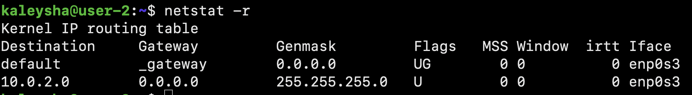

# Linux system installation and updates. Administration basics.

## Part 1. Installation of the OS

1. Install Ubuntu 20.04 Server LTS without GUI.

## Part 2. Creating a user

Create a user other than the one created during installation. 
The user must be added to **adm** group.

1. How many users exist before I add a new one.

2. A new user has been added.

>  **adm**: Group adm is used for system monitoring tasks. Members of
> this group can read many log files in /var/log, and can use xconsole.
> Historically, /var/log was /usr/adm (and later /var/adm), thus the
> name of the group.
> 

3. Group names for the new user (before and after being added to the adm group)

## Part 3. Setting up the OS network

Set the machine name as user-1

1. Hostname before any changes

2. After using the **set-hostname** command

Set the time zone corresponding to your current location.

Output the names of the network interfaces using a console command.

> When a physical network interface is disconnected for any reason, like a hardware 
> failure or being physically detached from the network, the machine can’t use it for any 
> communication, even with itself.
> However, because the loopback interface is only an internal virtual 
> interface with no physical hardware, the machine can use it anytime to communicate with itself.
> This can help in troubleshooting scenarios where we want to isolate and identify if a network 
> issue is caused by an internal problem inside the machine network stack itself.

Use the console command to get the ip address of the device you are working on from the DHCP server.

> A DHCP Server is **a network server that automatically provides and
> assigns IP addresses, default gateways and other network parameters to
> client devices**. It relies on the standard protocol known as Dynamic
> Host Configuration Protocol or DHCP to respond to broadcast queries by
> clients.

Define and display the external ip address of the gateway (ip) and 
the internal IP address of the gateway, aka default ip address (gw).

Set static (manually set, not received from DHCP server) ip, gw, dns settings 
(use public DNS servers, e.g. 1.1.1.1 or 8.8.8.8).

Reboot the virtual machine. Make sure that the static network settings (ip, gw, dns)
correspond to those set in the previous point.

Successfully ping 1.1.1.1 and ya.ru remote hosts and add a screenshot of 
the output command to the report. There should be "0% packet loss" phrase in command output.

## Part 4. OS Update

Update the system packages to the latest version

## Part 5. Using the sudo command

Allow user created in Part 2 to execute sudo command.

In the report explain the true purpose of sudo command (don’t write about the fact that this word is "magic" one);
> The sudo command allows you to run programs with the security privileges of another user 
>(by default, as the superuser). It prompts you for your personal password and confirms your 
>request to execute a command by checking a file, called sudoers , which the system administrator configures

Change the OS hostname via the user created in Part 2 (using sudo):
1. First of all, I switched to superuser using **sudo su -** command
2. I set the password to **neUser**

3. I switched to newUser and changed hostname

## Part 6. Installing and configuring the time service

Set up the automatic time synchronisation service.

